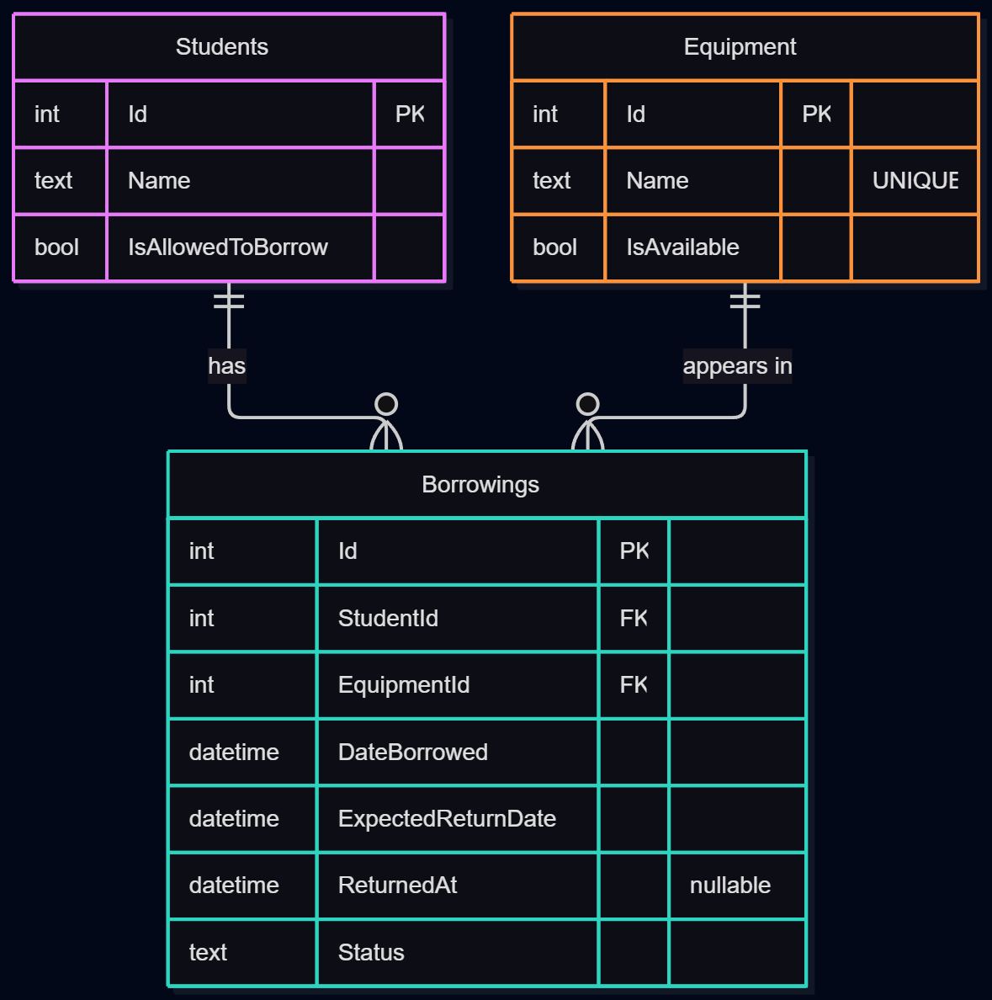

# Equipment Borrowing System

A small C#/.NET solution demonstrating a layered application structure (Domain / Application / Infrastructure) for a campus equipment borrowing scenario. Built for ITSD 81 Laboratory Activity 1.

---

## 1. Solution Structure

- **Domain** — Contains the core concepts of the problem itself: `Student`, `Equipment`, `Borrowing`, and `BorrowingStatus`. These classes hold data and simple state-changing behavior (e.g. `MarkAsUnAvailable()`, `MarkAsReturned()`), but know nothing about how they are saved, fetched, or displayed.
- **Application** — Contains the use cases and coordination logic. This includes the repository interfaces (`IStudentRepository`, `IEquipmentRepository`, `IBorrowingRepository`) that describe *what* data operations the application needs, and `BorrowEquipmentService`, which coordinates domain objects and repositories to execute the "Borrow Equipment" use case.
- **Infrastructure** — Contains the concrete, technical implementations of the repository interfaces. For this activity, that means simple in-memory repositories (`InMemoryStudentRepository`, `InMemoryEquipmentRepository`, `InMemoryBorrowingRepository`) that store data in C# `List<T>` collections instead of a real database.
- **Tests** — Reserved for automated tests of application/domain behavior (initial project structure only, per activity scope).
- **ConsoleDemo** — A minimal runnable console program that wires everything together and demonstrates one successful and one failed borrow request.

---

## 2. Dependency Direction

```text
      ConsoleDemo
          │
          ▼
     Application
       │      ▲
       ▼      │
     Domain   │
              │
     Infrastructure
```

- **ConsoleDemo** depends on **Application** (to call `BorrowEquipmentService`) and on **Infrastructure** (to construct the concrete in-memory repositories).
- **Application** depends on **Domain** (it uses `Student`, `Equipment`, `Borrowing` directly) but does **not** depend on Infrastructure — it only knows about the repository *interfaces* it defines itself.
- **Infrastructure** depends on both **Domain** (to store domain objects) and **Application** (to implement its repository interfaces).
- **Domain** depends on nothing else in the solution — it is the most stable, independent layer.

---

## 3. Use Case Mapping

```text
Actor: Student
Use Case: Borrow Equipment
Application Service: BorrowEquipmentService.BorrowAsync
Domain Objects Used: Student, Equipment, Borrowing, BorrowingStatus
Repository Interfaces Used: IStudentRepository, IEquipmentRepository, IBorrowingRepository
Infrastructure Implementations Used: InMemoryStudentRepository, InMemoryEquipmentRepository, InMemoryBorrowingRepository
```

---

## 4. Reflection

**1. Why should the application service depend on a repository interface instead of directly depending on a database implementation?**

Depending on an interface means `BorrowEquipmentService` only needs to know *what* operations are available (e.g. "get a student by id"), not *how* they're carried out. This keeps the service usable regardless of where data actually lives — in-memory today, a real database later — without changing a single line of the service itself. It also makes the service easier to test, since a fake/in-memory repository can stand in for a real one.

**2. Which parts of your current solution could remain unchanged if SQLite were added later?**

The Domain layer (`Student`, `Equipment`, `Borrowing`, `BorrowingStatus`) and the Application layer (the repository interfaces and `BorrowEquipmentService`) would not need to change at all. Only the Infrastructure layer would change — the in-memory repositories would be replaced (or supplemented) with new classes that implement the same interfaces using SQLite/Entity Framework Core underneath.

**3. Which project would eventually contain Avalonia Views?**

None of the current four — a new UI project (e.g. `EquipmentBorrowing.UI` or similar, using Avalonia) would be added alongside them, referencing Application (and possibly Infrastructure, for startup/dependency wiring) the same way ConsoleDemo does now.

**4. Should an Avalonia button directly execute database queries? Why or why not?**

No. A button's click handler should call into the Application layer (e.g. `BorrowEquipmentService.BorrowAsync`), the same way `Program.cs` does in this activity. If UI code executed database queries directly, business rules (like the six borrowing checks) would end up duplicated or bypassed across every screen that needed them, and the UI would become tightly coupled to a specific database technology — defeating the whole purpose of separating these layers.

**5. What part of your implementation represents the actual business operation requested by the actor?**

`BorrowEquipmentService.BorrowAsync` is the actual business operation. It is the one place where all the real rules of "Borrow Equipment" — does the student exist, are they allowed to borrow, does the equipment exist and is it available, has the student hit their borrowing limit, and finally creating the record — are expressed and enforced.

---

## Demonstration

Run the `EquipmentBorrowing.ConsoleDemo` project (`F5` or `dotnet run`) to see:
- **Success case:** Student 1 (allowed to borrow) borrows Equipment 1 (available) → borrowing is created.
- **Failure case:** Student 2 (not allowed to borrow) attempts to borrow Equipment 1 → request is rejected with an explanation.

"Note: Domain models and repository interfaces were part of earlier local work, committed together during service implementation"


---

## Activity 2: Avalonia UI and MVVM

### 1. Desktop Project

`EquipmentBorrowing.Desktop` is the presentation layer — it displays information, collects user input, and translates user actions into calls on existing Application services. It references `Application` (to call `BorrowEquipmentService`, `ReturnEquipmentService`, and the query services) and `Infrastructure` (only in the composition root, to construct the concrete in-memory repositories). Domain and Application remain completely unaware that Avalonia exists.

### 2. Updated Architecture

```text
Avalonia View
     │
     │ Binding / Command
     ▼
ViewModel
     │
     │ Application Operation
     ▼
Application Service
     │
     ├──────────► Domain
     │
     ▼
Repository Interface
     ▲
     │
Infrastructure Implementation
```

### 3. Borrow Equipment Flow

1. User selects a student, equipment item, and expected return date, then presses **Borrow Equipment**.
2. `EquipmentViewModel.BorrowCommand` runs presentation validation (are all three fields filled?).
3. If valid, it calls `BorrowEquipmentService.BorrowAsync(studentId, equipmentId, expectedReturnDate)`.
4. The service checks all six business rules (student exists/allowed, equipment exists/available, borrowing limit) against the repositories, and either creates the `Borrowing` or returns a failure reason.
5. The ViewModel sets `StatusMessage` from the result and reloads the equipment list so availability updates on screen.

### 4. Return Equipment Flow

1. User selects an active borrowing from the list and presses **Return Equipment**.
2. `BorrowingsViewModel.ReturnCommand` checks a borrowing is actually selected.
3. It calls `ReturnEquipmentService.ReturnAsync(borrowing)`, passing the already-selected `Borrowing` object directly (no re-lookup by ID needed).
4. The service validates it isn't already returned, marks it returned, marks the equipment available again, and saves the equipment update.
5. The ViewModel displays the result and reloads the active borrowings list.

### 5. Architectural Reflection

1. **Why should the View not call a repository directly?** If the View called the repository directly, it would be locked to one specific storage method (in-memory lists). Later, if we swapped to SQLite, the View itself would need to change — breaking the whole point of separating layers. Keeping the View away from repositories means the UI stays untouched no matter how data is actually stored.

2. **Why should business rules not be implemented in the ViewModel?** If business rules like borrowing limits were written inside the ViewModel, and another screen later needed the same rule, we'd end up duplicating that logic in two places. If the rule ever changed, we'd risk forgetting to update it everywhere it was copied — leading to inconsistent behavior. Keeping rules in one Application service means there's only one place to trust and one place to fix.

3. **What is the responsibility of the ViewModel?** The ViewModel holds presentation state (like SelectedEquipment, StatusMessage) and exposes commands (BorrowCommand) that the View can bind to. It doesn't decide whether a borrow is allowed — it just collects what the user picked and forwards it to the Application service, which does the actual checking.

4. **Why can the existing Application layer work without knowing that Avalonia is being used?** The Application layer only depends on repository interfaces and Domain objects — nothing in BorrowEquipmentService.cs references Avalonia at all. Because it only knows about plain C# interfaces, any UI technology (console, Avalonia, web) can be built on top of it without changing anything inside Application.

5. **What advantage is gained from registering dependencies in one composition point?** Only App.axaml.cs needs to change if we ever swap repositories — for example, replacing InMemoryEquipmentRepository with a real SQLite one. Since every ViewModel and service just asks the DI container for an interface, none of them need to be touched, which lowers the risk of forgetting to update something elsewhere.

6. **If the in-memory repository were replaced by SQLite later, which parts of the current interface should remain largely unchanged?** Views, ViewModels, and Application services would all stay unchanged. Only the Infrastructure implementations (the InMemory... repository classes) would need to be replaced with SQLite versions, along with the one registration line in App.axaml.cs that wires them up.

---

# Laboratory Activity 3 – From In-Memory Data to Persistent Storage

## 1. Relational Database Design



| Table | Columns | Keys / Constraints |
|---|---|---|
| Students | Id, Name (max 100), IsAllowedToBorrow | PK: Id |
| Equipment | Id, Name (max 100), IsAvailable | PK: Id; UNIQUE index on Name |
| Borrowings | Id, StudentId, EquipmentId, DateBorrowed, ExpectedReturnDate, ReturnedAt (nullable), Status (text, max 20) | PK: Id; FK: StudentId to Students.Id; FK: EquipmentId to Equipment.Id; indexes on StudentId, EquipmentId, Status |

A student can have many borrowings, and a piece of equipment can appear in many borrowings over time. A borrowing stores IDs instead of copying student or equipment details, so each fact is stored once. `ReturnedAt` is the only optional column because it stays empty until the item is returned. Sample SQL is in `docs/database-queries.sql`.

## 2. SQLite and EF Core

The packages `Microsoft.EntityFrameworkCore.Sqlite` and `Microsoft.EntityFrameworkCore.Design` were added to the Infrastructure project, and the `dotnet-ef` tool was installed globally. All database code stays in Infrastructure. The Desktop project only registers the services at startup, in `App.axaml.cs`.

## 3. DbContext

`EquipmentBorrowingDbContext` represents the database. It exposes a `DbSet` for each table (Students, Equipment, Borrowings) and loads the entity configurations (`StudentConfiguration`, `EquipmentConfiguration`, `BorrowingConfiguration`). These define the keys, required fields, maximum lengths, the unique index, the foreign keys, and the enum-to-text conversion for `Status`. The domain classes contain no persistence code.

## 4. Repository Transition

Before:

    Repository Interface -> In-Memory Repository

After:

    Repository Interface -> EF Core Repository -> DbContext -> SQLite

`EfStudentRepository`, `EfEquipmentRepository`, and `EfBorrowingRepository` implement the same interfaces as the in-memory versions. The services and ViewModels did not change, except that `UpdateAsync` was added to `IBorrowingRepository` and `GetAvailableAsync` to `IEquipmentRepository`. The registrations in `App.axaml.cs` now point to the EF repositories. The database file is stored at `%LocalAppData%\EquipmentBorrowing\equipmentborrowing.db`.

## 5. Migration Process

Create the migration:

    dotnet ef migrations add InitialCreate --project src\EquipmentBorrowing.Infrastructure --output-dir Migrations

A second migration, `AddSeedData`, inserts the initial students and equipment:

    dotnet ef migrations add AddSeedData --project src\EquipmentBorrowing.Infrastructure --output-dir Migrations

Apply the migrations:

    dotnet ef database update --project src\EquipmentBorrowing.Infrastructure

The app also calls `Database.Migrate()` at startup. It creates the database on first run and leaves existing data untouched afterwards.

Seed data: students Ana Reyes, Ben Cruz, Carla Santos (not allowed to borrow); equipment Laptop 01, Laptop 02, Projector 01, Camera 01 (unavailable).

## 6. Generated SQL

**Query 1: Active borrowings**

    _context.Borrowings.AsNoTracking()
        .Where(b => b.Status == BorrowingStatus.Active)
        .ToListAsync();

Generated SQL:

    SELECT "b"."Id", "b"."DateBorrowed", "b"."EquipmentId", "b"."ExpectedReturnDate",
           "b"."ReturnedAt", "b"."Status", "b"."StudentId"
    FROM "Borrowings" AS "b"
    WHERE "b"."Status" = 'Active'

Explanation: EF Core turns the enum comparison into a text comparison because `Status` is stored as text, and filters the rows in the database.

**Query 2: All equipment**

    _context.Equipment.AsNoTracking().ToListAsync();

Generated SQL:

    SELECT "e"."Id", "e"."IsAvailable", "e"."Name"
    FROM "Equipment" AS "e"

Explanation: a plain SELECT of every equipment row. LINQ does not remove SQL; EF Core translates the C# query into SQL.

**Query 3: Available equipment** (`GetAvailableAsync`) filters on `IsAvailable` and orders by `Name`.

**Tracking:** display-only queries (equipment list, active borrowings, students) use `AsNoTracking()` because nothing is modified, so EF skips change-tracking and uses less memory. `EfEquipmentRepository.GetByIdAsync` is tracked because the service changes the equipment and saves it.

## 7. Persistence Demonstration

1. Started the app and borrowed Laptop 02 as Ana Reyes. The borrowing appeared in Active Borrowings.
2. Closed the app completely and started it again. The borrowing was still listed.
3. Returned the equipment, closed and restarted the app. Active Borrowings was empty and Laptop 02 showed Available: True.

Screenshots are in the `screenshots/` folder.

## 8. Architectural Reflection

1. **Why was no rewrite needed?** The services depend on repository interfaces, so only the repository implementations and the dependency registrations were swapped.
2. **Why should the ViewModel not use DbContext directly?** It would tie the UI to EF Core and SQLite, mix presentation with persistence, bypass the business rules in the services, and make testing and later changes harder.
3. **What does the repository implementation do now?** It translates application requests (get, add, update) into EF Core queries and saves changes to SQLite.
4. **Purpose of a migration:** it records schema changes as versioned code, so the database can be created and reproduced from the project history.
5. **Why are foreign keys important?** They guarantee every borrowing points to an existing student and equipment, preventing orphan records.
6. **Why does a read-only query benefit from AsNoTracking()?** EF does not need to track entities that will not be modified, which saves memory and time.
7. **If SQLite were replaced by another provider:** only the provider package, connection string, and migrations would change in Infrastructure and the composition root. Domain, Application, ViewModels, and Views would stay the same.